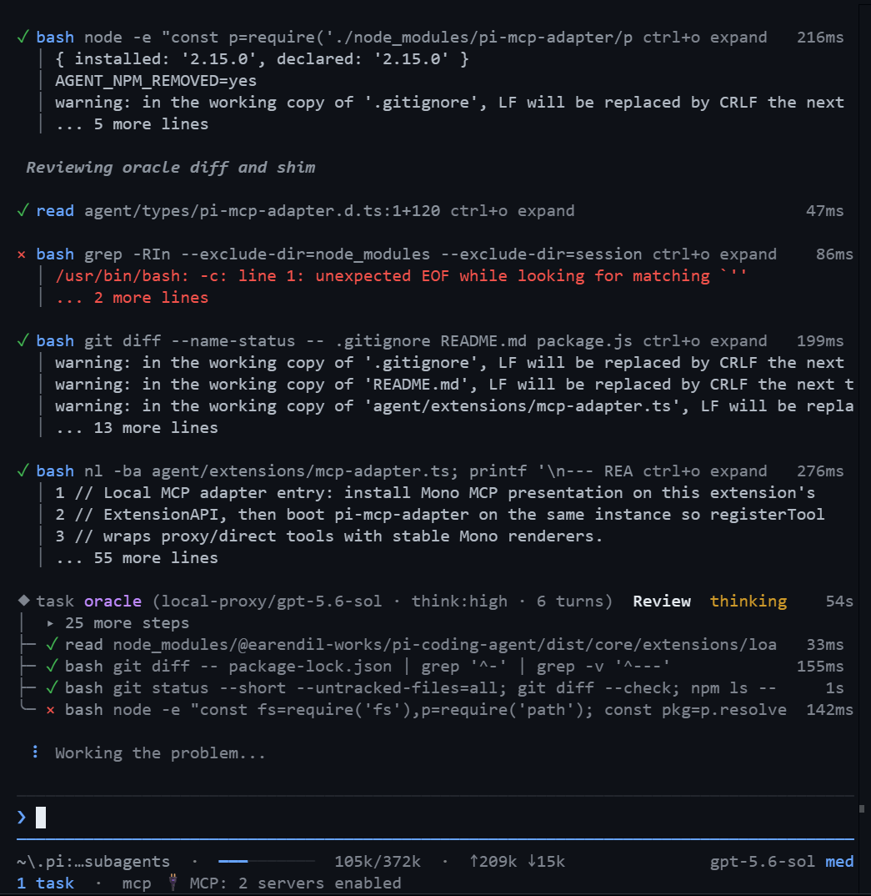
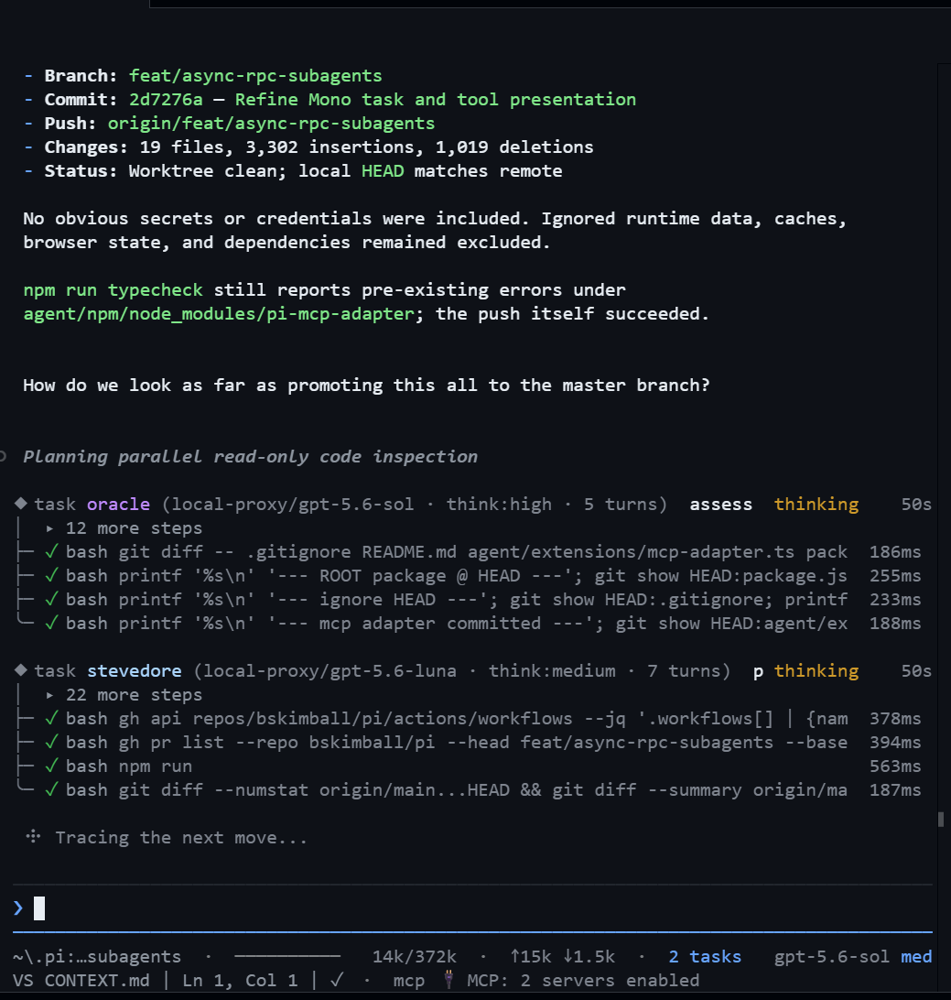
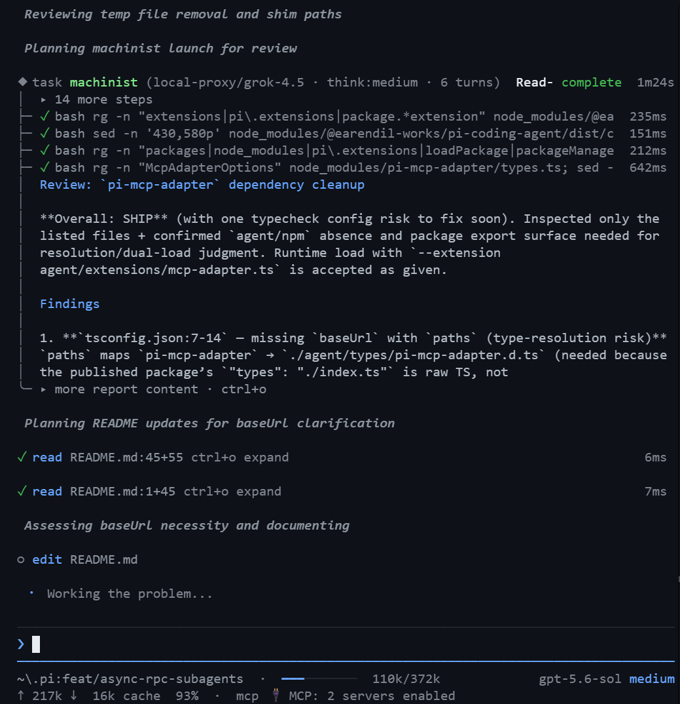

import AgentTopologyDiagram from '../../components/blog/pi-workflow/AgentTopologyDiagram.astro'
import ReviewLoopDiagram from '../../components/blog/pi-workflow/ReviewLoopDiagram.astro'

A single coding agent works until its context becomes a record of every abandoned idea, file search, implementation attempt, and test failure from the entire job. Better models delay that failure. They do not remove it.

I use [Pi](https://github.com/earendil-works/pi-mono) as the host for a different shape of workflow: one lead agent coordinates nine specialists, dispatches isolated work, reviews the evidence, and keeps responsibility for the final result. The configuration started with one synchronous `task` tool. It now supports both disposable missions and persistent, steerable RPC workers.

The full configuration is public at [github.com/bskimball/pi](https://github.com/bskimball/pi). The repository contains the agent definitions, lead prompt, extensions, skills, and restore instructions described here. Secret-bearing and machine-local files remain excluded.

The useful part is not the role-playing names. It is the process boundary.

_This is the interface I use every day. Successful and failed tools, elapsed time, the active oracle mission, token traffic, model state, MCP connections, and task count remain visible without dumping child transcripts into the lead context._

## The lead agent protects its context for judgment

When one agent owns every phase of a substantial change, its context window becomes a junk drawer:

- reconnaissance notes crowd out the current edit
- failed debugging branches influence later decisions
- implementation details displace the original requirements
- review becomes a reread of the implementer's own reasoning
- release commands get mixed into design and architecture debate

My main system prompt treats the lead as an orchestrator first. It still handles small work directly, but it delegates anything that would consume the context needed for integration and judgment.

The triage is explicit:

- **Inline** for one known file, one small edit, or one direct answer
- **Delegate** for multi-file work, broad investigation, substantial UI work, or difficult debugging
- **Parallelize** only when units are independent
- **Serialize** when units touch the same files or depend on the same decision

Delegation does not transfer ownership of the user's outcome. The lead writes the work order, checks the returned evidence, reconciles disagreements, runs combined validation, and gives the final answer.

That distinction matters. Without it, subagents become an elaborate way to say, "someone else said it passed."

## Nine specialists replace one overloaded mega-prompt

Each specialist is defined in a Markdown file with YAML frontmatter. The frontmatter controls its model route, fallback models, thinking level, tools, skill inheritance, and turn budget. The Markdown body is the role's system prompt.

The roster is intentionally narrow:

1. **advisor** evaluates consequential approaches and tradeoffs before implementation.
2. **artisan** owns substantial UI, layout, visual hierarchy, and interaction polish.
3. **librarian** researches external libraries, framework internals, documentation, and reference implementations.
4. **machinist** handles concrete non-visual implementation such as backend logic, refactors, migrations, and bug fixes.
5. **oracle** provides an independent review or a second opinion on difficult debugging.
6. **picasso** generates image assets from a visual brief.
7. **scout** performs fast, read-only reconnaissance across the local codebase.
8. **scribe** writes and revises long-form technical content.
9. **stevedore** handles bounded operational work such as builds, git mechanics, and platform CLIs.

The names make the terminal easier to scan, but the tool boundaries do the real work. Scout does not need edit access. Librarian should not improvise local patches. Artisan is not interchangeable with a backend coder just because both can write TypeScript. Oracle is valuable because it inspects the actual diff from a fresh process, not because it produces a ceremonial approval paragraph.

## The topology stays star-shaped

The system has one coordinator. Workers do not grow their own worker farms.

<AgentTopologyDiagram />

Child processes receive their role prompt and a self-contained work order, not the parent's conversation. Task tools are excluded from child runtimes, so escalation returns to the lead instead of creating an unbounded process tree.

This also keeps shared-state decisions in one place. A worker can report that a push, deploy, deletion, or migration is ready. The lead remains responsible for deciding whether that action should happen.

## Self-contained work orders are the shared memory

A fresh context window is only helpful if the prompt contains enough context to act correctly. My work orders follow a deliberately boring structure:

- **Goal:** the user-visible outcome
- **Scope:** files, directories, behavior, and non-goals
- **Context:** constraints and decisions already made
- **Task:** the exact implementation, investigation, or review request
- **Evidence:** the files, commands, or documentation to inspect first
- **Validation:** the narrowest useful check
- **Return format:** changed files, findings, test results, blockers, and residual risks

The lead is the shared blackboard. There is no hidden memory service that lets a child recover a requirement omitted from its prompt.

That constraint improves the main session too. If I cannot explain a delegated unit clearly, I probably have not decomposed the problem clearly.

## Synchronous tasks are disposable, queued missions

The original orchestration path is still useful. This synchronous path launches a fresh `pi --mode json --no-session` process. It discovers the selected agent, validates the working directory, injects the specialist prompt, streams JSON events into the terminal UI, and returns the final report to the lead. JSON mode applies only to the synchronous `task` runner.

Synchronous tasks have a hard concurrency cap of three. Additional calls queue until a slot opens.

This mode works well for bounded jobs with a known result shape:

- map a subsystem and return relevant file paths
- review a diff without editing it
- implement one isolated change and run a targeted test
- research a library behavior and cite the source

The tradeoff is control. Once dispatched, a synchronous task cannot be steered mid-flight. If the brief is wrong, the lead waits for the task to finish or time out, reads the result, and starts a better-scoped mission.

The synchronous runner can walk the agent's configured model fallback chain when the primary route fails. The UI records the active model and whether a fallback was needed, while the lead receives the bounded report rather than the child's full transcript.

## Persistent RPC workers make delegation interactive

Some jobs need a longer relationship than one prompt and one report. Async tasks do not use JSON mode. `task_start` launches `pi --mode rpc` with an isolated, session-backed directory, then communicates with the child over Pi's RPC protocol. That exposes a persistent lifecycle instead of a single call:

- `task_start` launches a specialist and immediately returns a worker handle
- `task_status` shows bounded lifecycle, activity, errors, and pending interactions
- `task_list` shows active and recently settled workers
- `task_send` queues steering, a post-settlement follow-up, or a new prompt
- `task_wait` blocks until the current generation settles
- `task_abort` asks the worker to stop, then escalates if it does not cooperate
- `task_close` reaps the process and releases its concurrency slot
- `task_reply` answers a child UI checkpoint

The async runner has its own cap of three live workers. Unlike the synchronous queue, `task_start` rejects when all three slots are occupied. A settled worker still holds its slot until the lead calls `task_close`.

That explicit cleanup is not cosmetic. Persistent workers preserve useful state, but state has a lifecycle and a cost. Forgetting to close a worker is the orchestration equivalent of leaking a file descriptor.

Steering is also more precise than the name suggests. It does not interrupt a model halfway through inference or cancel a tool already running. A steer message waits for the next model-call boundary. Follow-up messages wait until the worker has fully settled. `task_abort` is the control for work that should actually stop.

The async path is now my default for implementation, uncertain investigation, and anything likely to need correction after the first result. The synchronous path remains better for short, deterministic lookups where persistence would be overhead.

## UI checkpoints cross the process boundary

RPC workers introduced a problem the synchronous runner did not have to solve: a child extension can ask the user a question.

Pi extensions can request a select, confirm, input, or editor dialog. An isolated child cannot display that interaction directly in the parent session, so the async runner records the request as a pending checkpoint. The lead sees it through `task_status` and answers it with `task_reply`, which sends the matching RPC response back to the child.

This is a small feature with a large architectural effect. It means persistent workers can use interactive extensions without pretending every decision was known at launch. The checkpoint is still mediated by the lead, so the star-shaped ownership model remains intact.

## Parallel work needs ownership, not optimism

The most important parallelism rule is not the concurrency limit. It is one writer per worktree.

Read-only agents can investigate in parallel. A librarian can research an API while a scout maps local call sites. Reviewers can inspect the same files because they are not modifying them.

Writers are different. Two agents editing the same worktree at the same time can invalidate each other's reads, overwrite nearby changes, and produce a result neither one actually tested. Parallel writers require isolated worktrees with disjoint ownership and an explicit integration step.

Most of the time, serialization is cheaper than clever conflict management. I use parallel fan-out for independent evidence gathering, not as a default display of agent abundance.

_Parallelism is most useful when ownership is clear. Here, oracle inspects the diff while stevedore checks build, branch, and release state._

## Model policy belongs to the role definition

The lead generally does not override models when dispatching work. Each specialist already has a primary model, ordered fallbacks, a thinking level, and a tool budget chosen for that role.

Scout can use a cheaper route because it returns paths and findings. Artisan gets a model suited to visual judgment. Machinist gets enough turns to implement and validate a concrete unit. Those defaults are part of the configuration, not choices the lead should reopen on every call.

Oracle is the exception. A review is only useful if the reviewer is at least as capable as the orchestrator on the question being judged. That might mean raising the thinking level within the same model family. It might mean switching families to challenge a correlated blind spot. Novelty is not the goal. Independent capability is.

The lead still evaluates the review. Fresh context prevents one class of bias, but it does not make the reviewer automatically correct.

## The custom Mono UI is an orchestration console

The stock terminal was designed around one agent calling tools. Once I had several specialists running, the presentation layer became part of the orchestration system. Streaming every child token into the main session would defeat context isolation, but collapsing a worker to a spinner would hide too much. The Mono UI sits between those extremes.

Its basic unit is a **tool receipt**. A collapsed receipt fits the operational facts on one row: status glyph, tool name, primary argument, optional stats, and duration. A short rail beneath it previews useful output. Expanding the receipt reveals a bounded body without changing how the tool itself executes.

The same receipt engine presents built-in tools such as `read`, `bash`, `edit`, and `write`, plus web-search and MCP calls. That consistency matters when one turn mixes a local file read, an Exa result, a platform API call, and a failed shell command. I can scan one visual grammar instead of decoding a different renderer for every extension.

Edits get special treatment. The expanded result shows a numbered contextual diff with line statistics and intra-line highlights. Writes capture the previous file contents when possible, so replacing a file still produces a real before-and-after diff instead of a generic success message.

Task presentation depends on the execution mode:

- synchronous `task` calls get a rich mission card with the specialist, model, thinking level, turns, activity tree, fallback state, and final report
- async RPC tools return bounded status and result views with lighter worker chrome, because persistent lifecycle control matters more than replaying a full mission card
- pending child dialogs remain visible as checkpoints until the lead answers them with `task_reply`

The footer is a second information layer. It anchors working directory and branch on the left, model and thinking level on the right, and fits token traffic, cache rate, active task count, MCP state, and VS Code state where terminal width allows. Fields degrade by priority as the window narrows instead of wrapping into an unreadable dashboard. The input keeps Pi's editor geometry intact, while the custom border, prompt glyph, and rotating working indicator make the current state easier to locate.

All large output is bounded by lines and characters. Renderers use width-aware fallbacks because a beautiful receipt that crashes on a narrow Windows terminal is not an improvement. Renderer failures go to `pi-render.log` and degrade to short text. `PI_MONO_UI=0` disables the layer entirely if I need to separate an interface bug from an agent or tool failure.

The distinction between a receipt and a transcript is the main design decision. I need to know that a worker inspected four files, changed two, hit one failed command, and passed its targeted validation. I usually do not need every intermediate sentence it generated while getting there.

## Repeated workflows became commands and local tools

The configuration has also moved beyond agent dispatch.

`/browser` and `/deploy` are native extension commands now, not just reusable prompt files. They perform deterministic setup before handing control back to the model. The browser command connects to a dedicated debug profile and injects the relevant operating instructions. The deploy command captures worktree facts and constructs a bounded handoff for stevedore.

`brainstorm` remains a prompt-level mode shift because its job is behavioral: generate divergent options and do not implement until the user chooses a direction.

External research is provided through local `web_search`, `fetch_content`, and `get_search_content` tools backed by Exa. Fetches are cached so the model can request bounded slices instead of stuffing whole pages into one result.

MCP support is composed locally too. The adapter and the Mono presentation layer share one extension API, which avoids initializing the protocol integration twice and keeps MCP receipts consistent with the rest of the terminal.

Long-running shell commands use a separate background-process extension with start, status, list, and kill operations. Dev servers and watchers should not force the agent to hold a foreground tool call open while other work continues.

## Implementation and review form a loop

The workflow treats review as part of implementation, not optional polish.

A tiny inline change can get a focused review from the lead. Delegated code, multi-file changes, difficult logic, and security-sensitive work enter a fresh-context review loop:

1. Machinist implements non-visual code, or artisan implements the user-facing interface.
2. Oracle inspects the actual files and diff, not just the worker's summary.
3. If oracle finds a valid issue, the original worker fixes it with the implementation context still available.
4. Oracle reviews the revised diff again.
5. The lead repeats the loop until the findings are resolved, rejected as incorrect, or surfaced as an explicit blocker.
6. The relevant validation runs after the final fixes.

<ReviewLoopDiagram />

The implementer and reviewer keep different jobs. Machinist or artisan owns the fix. Oracle owns the independent judgment. The lead decides whether a finding is real, speculative, already covered, or outside the requested scope.

_The implementation loop in practice: machinist returns a concrete finding, and the lead immediately plans the corrective edit before another review pass._

For higher-risk changes, the lead can run additional oracle passes with different strong models. This is not a vote where two reviews automatically beat one. Changing the model is useful when another model family may notice a different failure mode, or when the first review leaves conflicting evidence. Every oracle used for the final gate still needs to be at least as capable as the orchestrating model for the question under review.

The final answer states what passed, what failed, and what was not run.

I also encode delegation and verification gates in the lead prompt. If the lead personally scans half the repository instead of using scout, or implements a substantial multi-file unit instead of assigning the right specialist, it needs a concrete reason. This protects the coordination context from the very behavior the system was built to avoid.

## Crash logs and ignored secrets keep operations boring

A crash-logger extension records uncaught errors, rejected promises, stream failures, shutdown events, and process metadata. Environment markers distinguish the main Pi session from a named subagent. The logger is best-effort because a diagnostic hook that causes a second fatal error is worse than no logger.

The configuration repository is portable, but credentials are not part of the portable layer. Authentication, provider configuration, MCP secrets, web-search keys, generated sessions, caches, and browser profiles stay ignored.

The agent roster, prompts, extensions, and install metadata belong in git. Secret-bearing and machine-local state do not.

## The tradeoffs got sharper as the system improved

This setup is more capable than the original one-tool version. It also has more ways to fail.

**Two orchestration APIs require judgment.** A synchronous mission is simpler. A persistent worker is easier to steer but requires status handling and cleanup. Picking RPC for every lookup adds ceremony without improving the result.

**Persistent workers can leak capacity.** The async cap counts live workers until `task_close`, even after their current generation settles. The lead has to treat cleanup as part of completing the unit.

**The two caps are independent.** The synchronous runner and async runner each enforce three slots in their own codepath. That is not the same as one global six-worker budget, and I do not treat it as permission to saturate both.

**Fallback behavior is not identical.** The synchronous runner has a mature fallback walk. The async runner currently emphasizes session persistence and steering, and its model-routing behavior is less complete. I avoid promising identical recovery semantics across both modes.

**Isolation makes weak prompts fail faster.** A fresh worker does not inherit unstated decisions. Better work orders cost time up front, even though they save time later.

**Parallelism multiplies review work.** Four fast patches still need integration, combined validation, and a coherent final decision. Fan-out moves work around. It does not erase it.

**The extension surface needs testing.** Process control, JSON event parsing, RPC sessions, UI rendering, model routing, and platform-specific termination are real software. Daily use and crash logs catch problems, but they are not a substitute for deeper automated coverage.

## Why this configuration works for me

I built this configuration around the way I already prefer to work. I want one place to discuss the goal, make decisions, and see the final result. I do not want that same context window filled with every repository scan, documentation search, implementation detour, and review pass required to get there.

The specialist roles give recurring jobs a clear owner. Scout gathers local evidence. Librarian handles external research. Machinist or artisan implements. Oracle challenges the result. Stevedore handles the operational finish. I can change the model, tools, and turn budget for each role without rewriting the entire workflow every time.

The two task modes cover the delegation patterns I actually need. A synchronous task is enough for a bounded lookup or review. A persistent RPC worker is better when implementation needs steering, follow-up, or another pass after Oracle finds an issue. The custom UI lets me supervise both without flooding the lead session with worker transcripts.

This is not meant to be a universal agent framework or a claim that every coding task needs a team. I still make small changes inline. The configuration is useful when a job becomes large enough that discovery, implementation, review, and release work start competing for the same context.

The complete setup is available in the [public configuration repository](https://github.com/bskimball/pi). It includes the lead prompt, specialist definitions, extensions, skills, themes, and restore instructions. You can copy the whole setup, but the more useful approach is probably to take the boundaries that match how you work and discard the rest.
