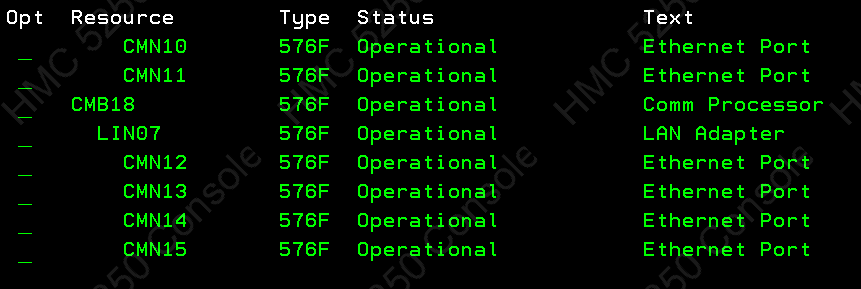
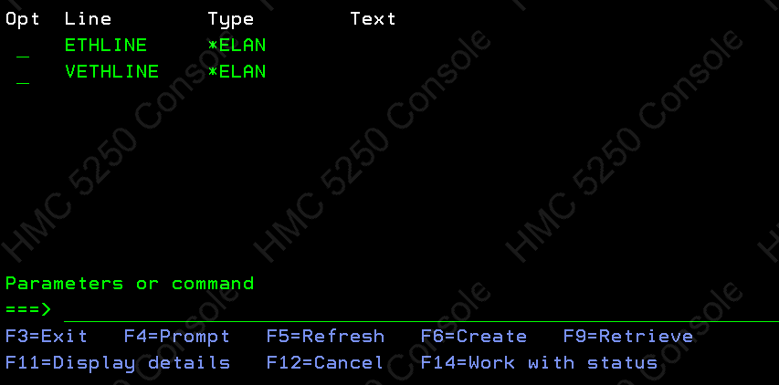
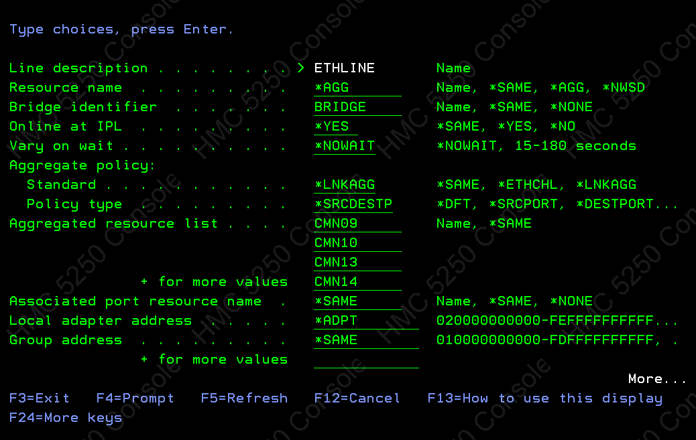

## What and Why?

Link Aggregation (LAGG) combines multiple physical interfaces into a single logical interface. This configuration offers two key benefits:

1.  **Redundancy:** By connecting a single IBM server to multiple switches, you minimize downtime. If one switch fails, the other maintains the connection.
2.  **Performance:** When both switches are operational, traffic uses all available network cables, increasing throughput.

## How?

Configuration varies by switch manufacturer (e.g., Cisco Nexus uses Virtual Port Channels, or VPCs). On IBM i, follow these steps:

1.  **Identify Interfaces:** Determine which physical interfaces to aggregate. Typically, a 4-port network adapter uses labels like `CMN03`–`CMN06`. Verify this with the command `WRKHDWRSC *CMN`.

2.  **Create Line Descriptor:** Use the `WRKLIND` screen and press F6 (or use the `CRTLIND` command) to create a new line descriptor.

3.  **Configure Resource Name:** Instead of a specific port (e.g., `CMN04`), specify `*AGG` as the resource name.

4.  **Set Aggregate Policy:** Match this to your switch configuration.
    - For Cisco switches using LACP, select `*LNKAGG` on IBM i.
    - For standard EtherChannel, use `*ETHCHL`.

5.  **Set Policy Type:** `*SRCDESTP` is the standard and most common setting.

6.  **Define Aggregated Resources:** List the physical interfaces to be included in the LAGG group.

Once configured, the new line descriptor functions like any other. You can assign static IP addresses and routing as usual, but with the added benefits of performance and redundancy.
