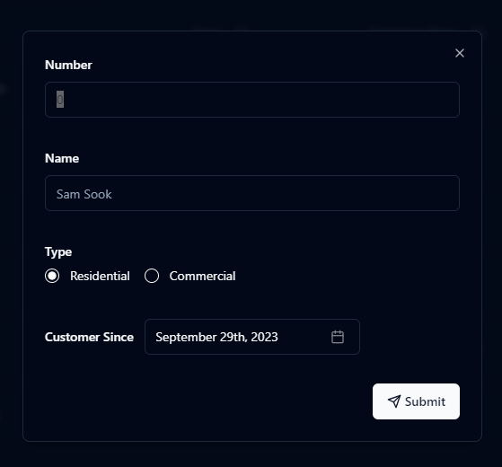
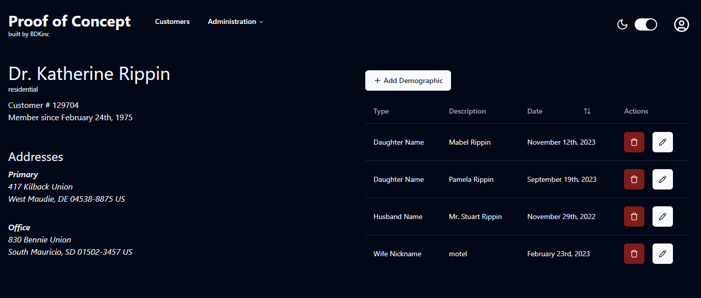

import Gallery from '@/components/Gallery.tsx'

[Github Repo](https://github.com/bskimball/reach)

[App Demo](https://poc.lam.bdkcloud.com)

## Preface

I built this prototype as a proof of concept for a client who needed to manage customer demographic data. The goal was to attach detailed demographics to customer profiles and automate courtesy emails for anniversaries or birthdays. Existing services do this, but the client needed something that integrated with their custom software ecosystem.

## Technical Decisions

**Backend**

The backend uses **TypeScript** and **[Feathers.js](https://feathersjs.com/)**. Feathers provided a rapid way to spin up a Node.js server with REST APIs, WebSockets, and services/hooks for CRUD operations.

**Frontend**

The frontend is a **TypeScript** SPA built with **[Vite](https://vitejs.dev/)** and **[React](https://react.dev/)**. Since SSR wasn't required, I avoided the complexity of meta-frameworks.

- **UI:** **[shadcn/ui](https://ui.shadcn.com/)**, combining **[Tailwind CSS](https://tailwindcss.com/)** for styling and **[Radix UI](https://www.radix-ui.com/primitives/docs/overview/introduction)** for accessible components.

**Infrastructure**

The application runs on **Docker**.

- **Database:** MySQL.
- **Proxy:** **[Traefik](https://traefik.io/traefik/)**, chosen for its seamless Docker integration.

  

  

<Gallery
  client:load
  slides={[
    { src: '/static/images/reach-app-home.png' },
    { src: '/static/images/reach-app-form.png' },
    { src: '/static/images/reach-app-customer-view.png' },
  ]}
/>
